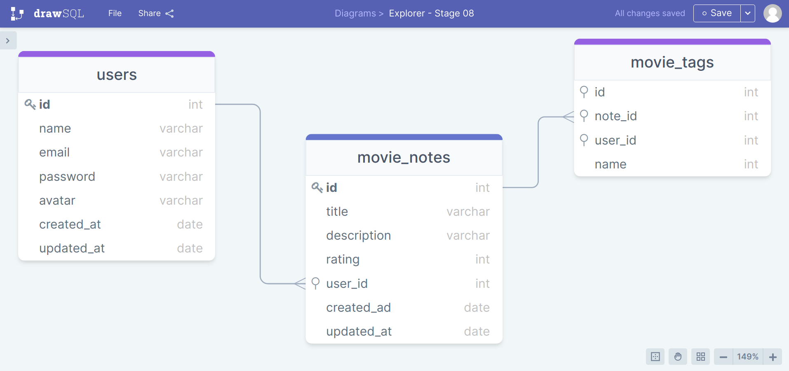

# Movie-API

> Criação de uma aplicação em Node.js onde o usuário cadastra um filme, preenche com algumas informações (nome, descrição, nota) e cria tags relacionadas a ele.
 

## Tecnologias
- Express
- NodeJS
- SQlite (SQL)
- Knex.js
 

 
 
 
